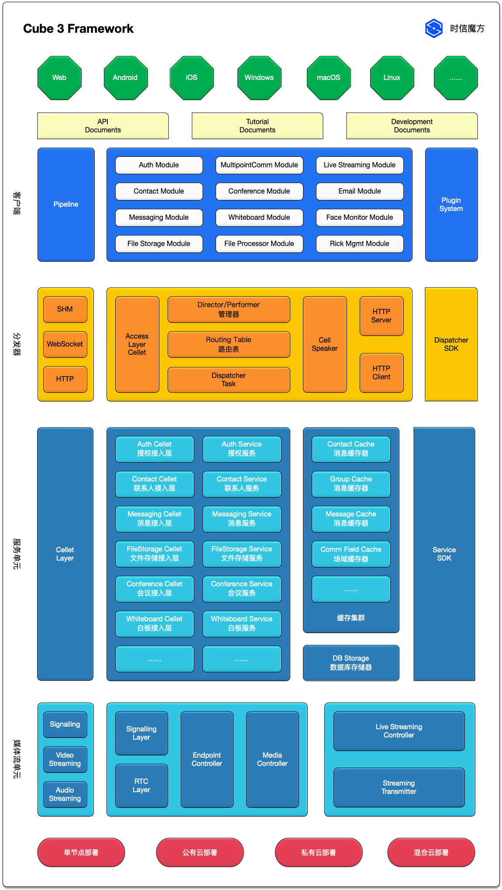

时信魔方按照功能场景把各个功能分解为：授权、联系人服务、消息服务、文件存储服务、实时音视频服务、会议管理等各个模块。每个模块专注于自身的业务场景，同时也会依赖其他模块辅助完成特定功能。

本文概要性地介绍主要的几大模块的功能服务。

<!--truncate-->

## 授权服务模块

授权模块是所有模块的基础，也会唯一一个被内核直接依赖的模块。

## 联系人/群组服务模块

联系人/群组模块是基础管理模块，时信魔方的基础业务单位就是“联系人”，联系人是指被系统接入的最小数据管理单位，也是基础账号系统。

在时信魔方里每个接入的终端都表示一个“联系人”，同一个联系人可以接入数台设备。多个联系人的管理集合称为群组。

* 联系人（账号）签入与签出
* 联系人数据管理（支持附录）
* 群组的创建、销毁、管理权限转移
* 群组数据管理（支持附录）
* 联系人分组管理

## 消息服务模块

消息模块即即时消息模块，是负责即时消息的发送和接收模块，并完成对消息全生命周期的管理。

* 消息发送、接收
* 消息文件附件管理
* 消息会话管理：关注（置顶）、分类、提醒方式、状态等。
* 消息类型扩展

## 文件存储服务模块

文件存储是时信魔方处理文件的基础服务，文件数据的上传、下载和存储管理都由此模块负责。时信魔方会为每一个联系人创建一个默认的存储空间。

* 文件上传存储
* 文件下载与下载链接管理
* 目录树结构管理
* 文件回收站管理

## 实时音视频服务模块

时信魔方的基础音视频 RTC 模块，该模块负责管理音视频 RTC 多方通信的信令服务和媒体服务。

* 信令管理
* 媒体设备控制
* 媒体流策略

## 会议管理模块

多人在线会议模块，该模块包含会议的申请、日程管理、参会人员管理、参会文档管理、会议控制、会议录音录像、会议直播等功能。

* 会议生命周期管理
* 参会人管理
* 会议文档管理
* 会议录音与录像存储

> 未完待续
